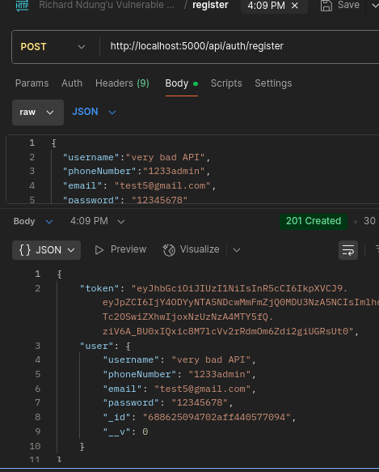
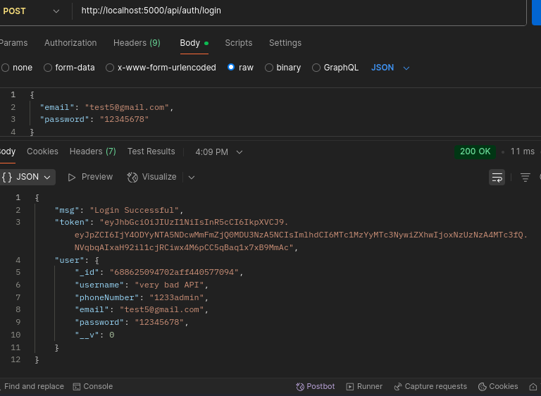
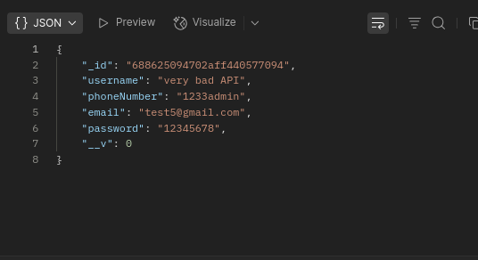

# Vulnerable-auth-API
Intentionally-insecure-auth-api
** Disclaimer**: This API is insecure do not use it.It  contains vulnerabilities for cyber security research.
## Vulnerabilities Include
-No input validation
-Sensitive data exposure
-Error leak- Returns rack backend error
-Insecure Direct Object Reference(IDOR)
-Hardcoded and exposed credentials
-Weak passwords

## Tech stack

```
-Node.js
-Mongo
-Docker support-
```
## Learn
user POSTMAN to test the the API in the local environment
Test other vulnerabilities
Edit the code to get more vulns

## How to run
Run the docker image in docker containers
```docker compose up --build```
Run on VS code
```node app.js ```

## The project
This project will help you get to interact with real vulnerable API.
The project contains a source code of an authentication API commented in blocks to allow us have a vulnerable API.

## POSTMAN Link

-[ ] .[link](https://documenter.getpostman.com/view/45175938/2sB3B7Mt8x)

## Postman Images
The images below shows what the API returns

Register




Login 



Profile




## Deploying to AWS (ECR + ECS / Fargate)

These are concise steps to build the image, push it to Amazon ECR, and run it on ECS (Fargate).

1. Build a production image locally (adjust the tag):

```
docker build -t your-ecr-repo-name:latest .
```

2. Create an ECR repository (one-time):

```
aws ecr create-repository --repository-name your-ecr-repo-name --region YOUR_AWS_REGION
```

3. Authenticate Docker to ECR and push the image (replace region/account id):

```
aws ecr get-login-password --region YOUR_AWS_REGION | docker login --username AWS --password-stdin YOUR_AWS_ACCOUNT_ID.dkr.ecr.YOUR_AWS_REGION.amazonaws.com
docker tag your-ecr-repo-name:latest YOUR_AWS_ACCOUNT_ID.dkr.ecr.YOUR_AWS_REGION.amazonaws.com/your-ecr-repo-name:latest
docker push YOUR_AWS_ACCOUNT_ID.dkr.ecr.YOUR_AWS_REGION.amazonaws.com/your-ecr-repo-name:latest
```

4. Deploy to ECS/Fargate:

- Create a Task Definition that uses the pushed image and maps container port 3000.
- Ensure the container's command or app listens on 0.0.0.0 and uses the PORT environment variable if configured.
- Create a Service (Fargate) and an Application Load Balancer if you need HTTP access.

Notes:
- The Dockerfile in this repository exposes port 3000 and sets NODE_ENV=production. Override PORT via ECS task definition environment variables if you need a different port.
- For automated CI/CD, integrate the push steps into your pipeline (GitHub Actions, CodePipeline).

CI smoke-test
---------------
This repository includes a GitHub Actions workflow `.github/workflows/ci-build-test.yml` that:
- Builds the Docker image with BuildKit enabled
- Starts a temporary `mongo` container on a network
- Starts the app container and waits for the startup log

To reproduce locally (use BuildKit to support `COPY --chown`):

```bash
DOCKER_BUILDKIT=1 docker build -t vuln-auth-api:local .
docker run -p 3000:3000 -e MONGO_URI='mongodb://host.docker.internal:27017/authdb' vuln-auth-api:local
```

Run the CI workflow by pushing a branch / creating a pull request; it will build and smoke-test the container before merge.


